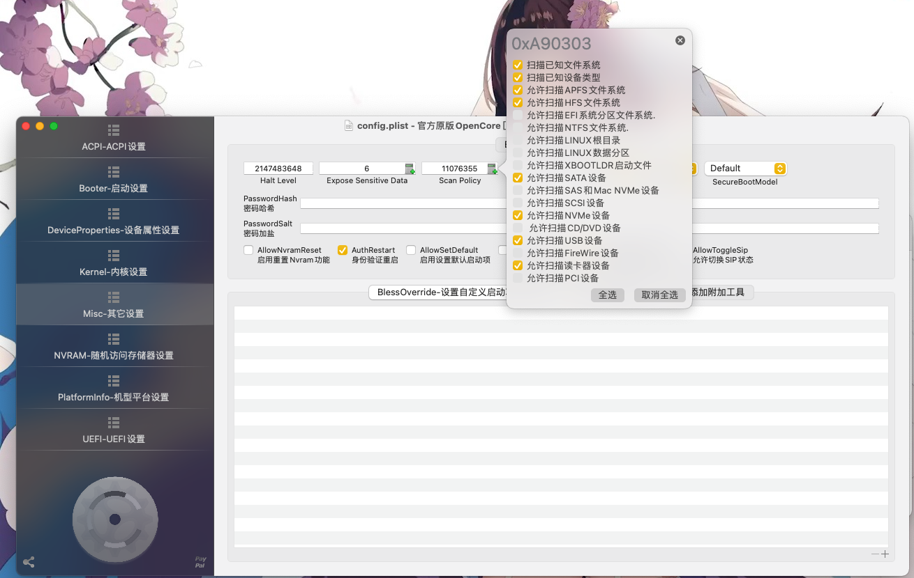
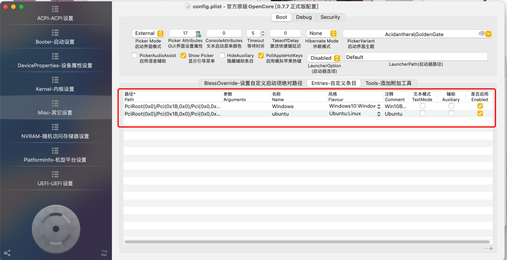
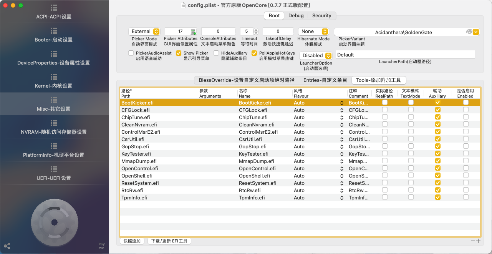
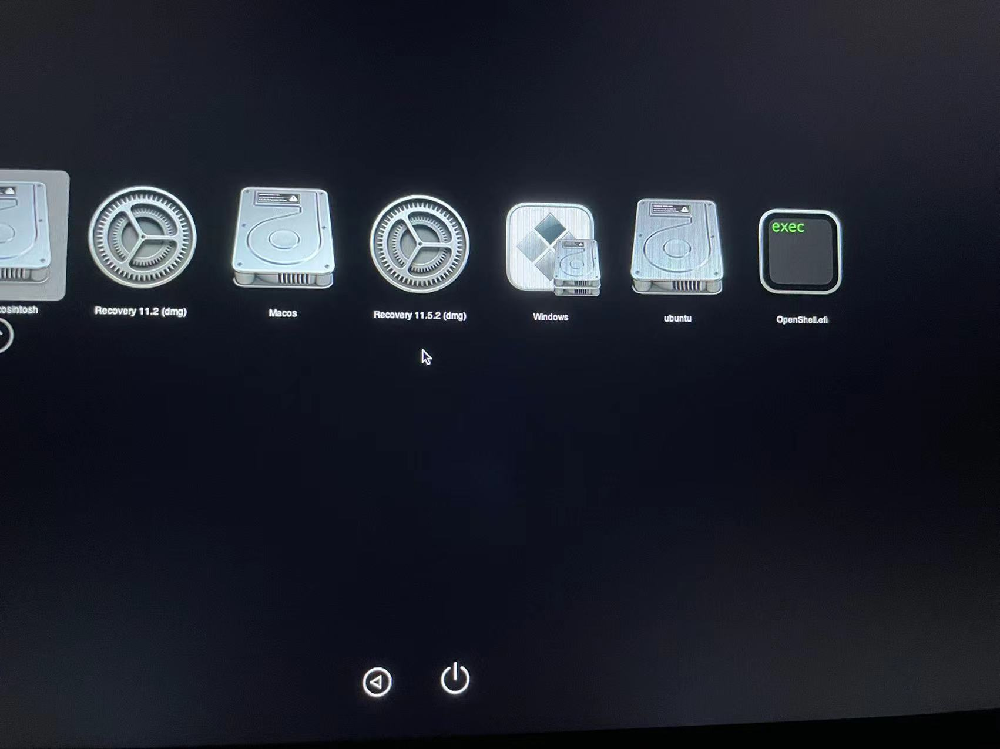
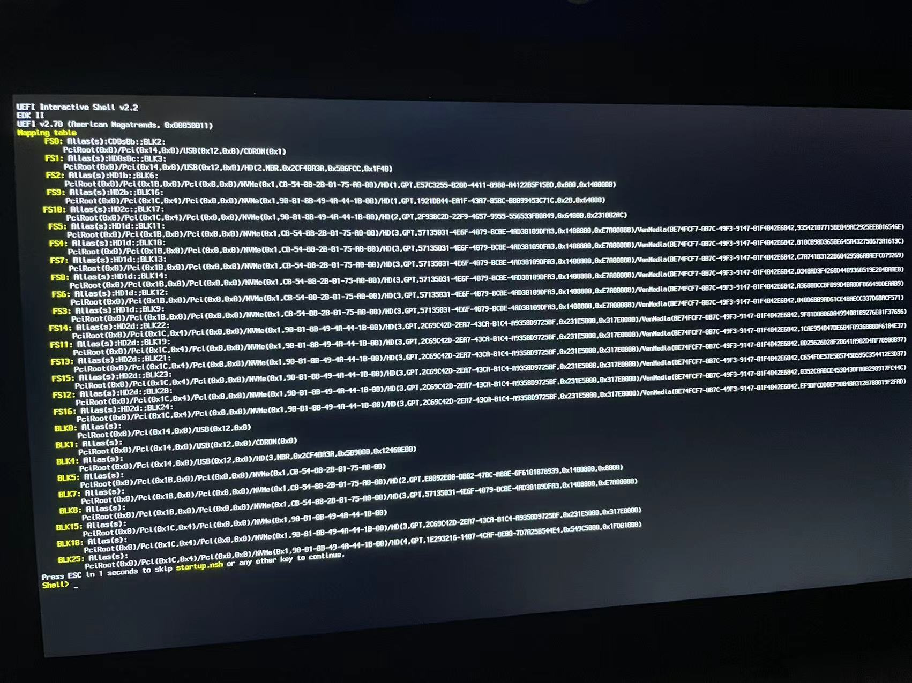
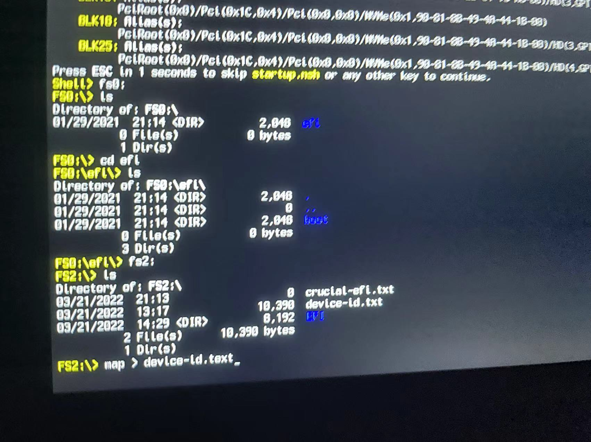
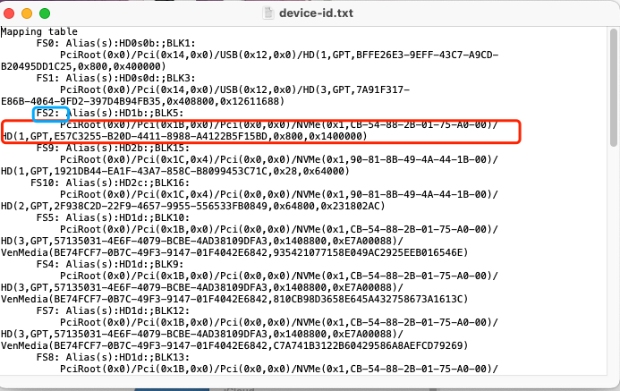
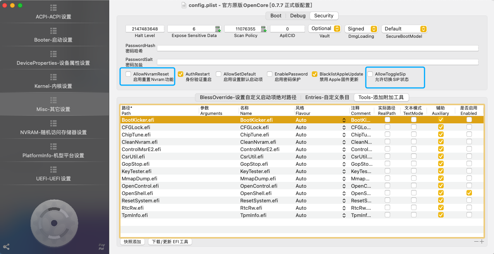
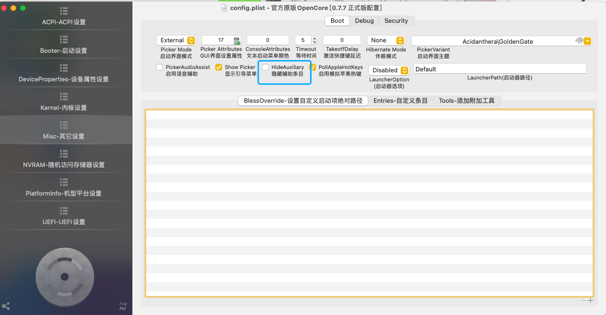
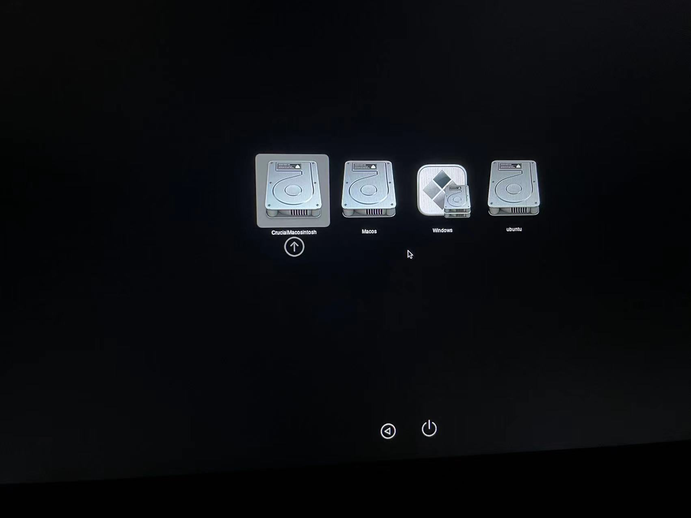

# 1. 为什么我们要自定义启动项？

使用OpenCoreConfigurator打开配置文件，依次选择"Misc"-"Security"。默认情况下，OpenCore引导会将"扫描策略"(Scan Policy)全部选项开启，因此如果我们安装了Windows双系统，那么OpenCore其实也是可以引导Windows的，因为它会扫描到所有的设备启动项。但是这样做的坏处是，我们安装的黑苹果系统所处的启动项位置不能固定，也就导致每次开机我们都得手动去选择要进行启动的操作系统，一不注意就上错系统，得重启重新选择了！

但是如果我们想自定义启动项的顺序应该怎么办？首先，我们应该将"允许扫描EFI系统分区文件系统"这个扫描策略进行关闭。如果我们将这个策略去进行了关闭，那么在OpenCore下，就无法扫描到之前安装的Windows的启动项(或者Linux相关的启动项)。

那么在关闭这个选项之后，我们应该如何让想要通过OpenCore引导的操作系统(比如Windows、Linux)展示在OpenCore引导页面呢？

我们要做的，就是在"Misc"-"Entries"-自定义条目"中，添加自己想要引导的操作系统的启动项。

# 2. 如何自定义启动项？

如何添加呢？首先，我们要确保自己的OC引导的"Tools"中存在有"OpenShell.efi"驱动。接着，在"Misc"-"Tools"中**添加OpenShell工具并启用**。

接着要做的，就是重启到OC的开机引导界面，就会出现OpenShell工具，如下图所示。

打开OpenShell工具，我们可以看到这里列出了当前我们计算机当中的所有的分区。我们要做的，就是找到我们要添加的启动项的分区。

依次使用"fs0:"、"fs1"、....等命令进入该分区，使用"cd"命令切换到某个目录，通过"dir"或者"ls"命令列出当前目录下的文件(熟悉编程的都懂)。我们要根据展示的分区中的文件信息的状况，去找到你要添加启动项的操作系统的EFI分区，**一定要记住该分区是fs几，比如我这里是fs2就是要添加的启动项的EFI分区，我们记录下来**。

接着，使用"map > device-id.txt"命令(用到重定向，其中的文件名可以自定义)，将map信息输出到device-id.txt文件当中。

接着，在文件系统当中去找到你输出的文件，**根据你记下来的fs几，去找到后面跟的设备id**，比如我这里跟着的是`PciRoot(0x0)/Pci(0x1B,0x0)/Pci(0x0,0x0)/NVMe(0x1,CB-54-88-2B-01-75-A0-00)/HD(1,GPT,E57C3255-B20D-4411-8988-A4122B5F15BD,0x800,0x1400000)`，使用一个文本文件记录下来。

接着：

* 1.如果你的系统是Windows系统，那么在后面拼接上`/\EFI\MICROSOFT\BOOT\BOOTMFGW.efi`(Windows Boot Manager的BootLoader)者 `/\EFI\BOOT\BOOTX64.efi`(UEFI规范下的BootLoader)。
* 2.如果你的系统是Ubuntu系统，那么在后面拼接上`/\EFI\ubuntu\grubx64.efi`。
* 3.别的系统我暂时不太清楚，没装过。

比如我是Ubuntu系统，那么得到EFI引导文件的完整路径`PciRoot(0x0)/Pci(0x1B,0x0)/Pci(0x0,0x0)/NVMe(0x1,CB-54-88-2B-01-75-A0-00)/HD(1,GPT,E57C3255-B20D-4411-8988-A4122B5F15BD,0x800,0x1400000)/\EFI\ubuntu\grubx64.efi`。

接着使用OpenCoreConfigurator打开config配置文件，点击右下角的"+"添加启动项，并使用鼠标右键进行编辑。

* 1.Path要配置的是刚刚得到的拼接的路径。
* 2.参数不用添加，名称按照自己的喜欢命名即可(不能有中文)
* 3.风格可以仿照"Windows10:Windows"、"Ubuntu:Linux"去进行填写。(不能有中文)
* 4.注释的作用是方便以后我们能知道这个启动项是干嘛的，可以不填。
* 5.将"是否启用"选项打上勾去进行启用该启动项。
* 6.如果要添加多个系统的启动项，也可以仿照添加多个，比如同时设置Windows和Ubuntu，但是要注意的是如果同时设置Windows和Ubuntu，**可能多个系统的EFI引导分区并不是同一个**，也就是设备id并不是同一个。

# 3. 简化OpenCore的引导选择页面

为了美观起见，可以在Tools中关闭OpenShell工具的启用，这样OC引导页面上就不会有该工具了，后期需要使用时，再启用即可，不必直接一直OC引导当中。其他Tools选项需要进行隐藏的也可以同理进行关闭启用，我一般会全部关闭。

还有一些选项我们可以进行关闭：

关闭在"Misc"-"Security"下的"AllowNvramReset"、"AllowToggleSip"这两个选项，可以让OC引导页面可以少显示很多启动的EFI

关闭"Misc"-"Boot"中的"HideAuxiliary"选项，可以让OC引导页面变得更美观(连MacOS的Recovery都不显示了)。

关闭以上的全部选项之后，几乎得到的就是一个纯粹的系统选择的启动项了！如下图所示，就纯粹的选择系统的启动项。

