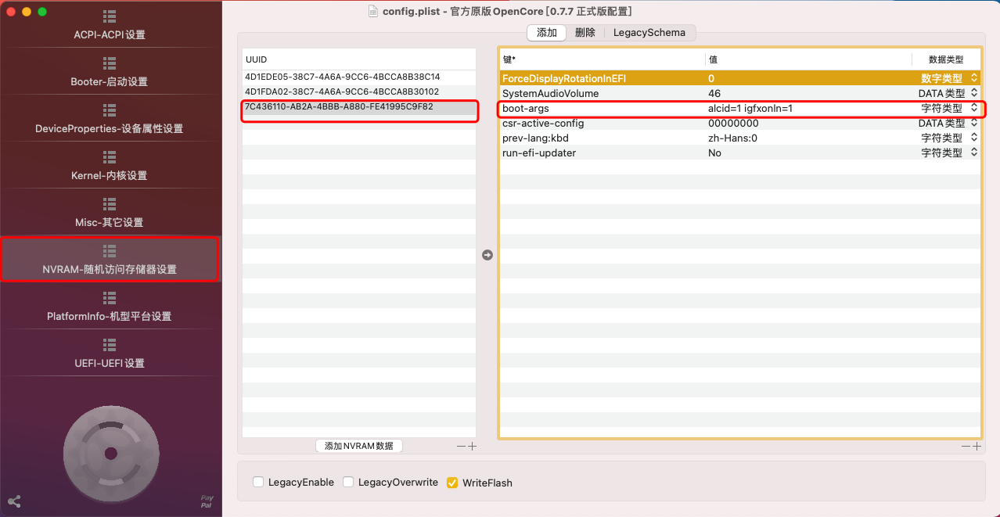
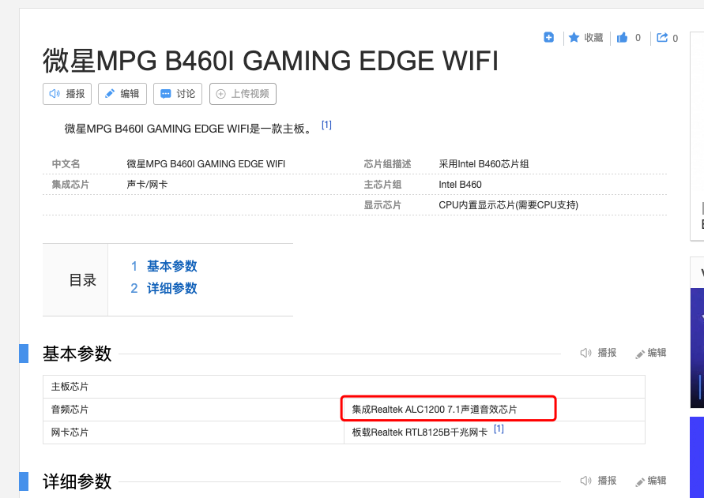
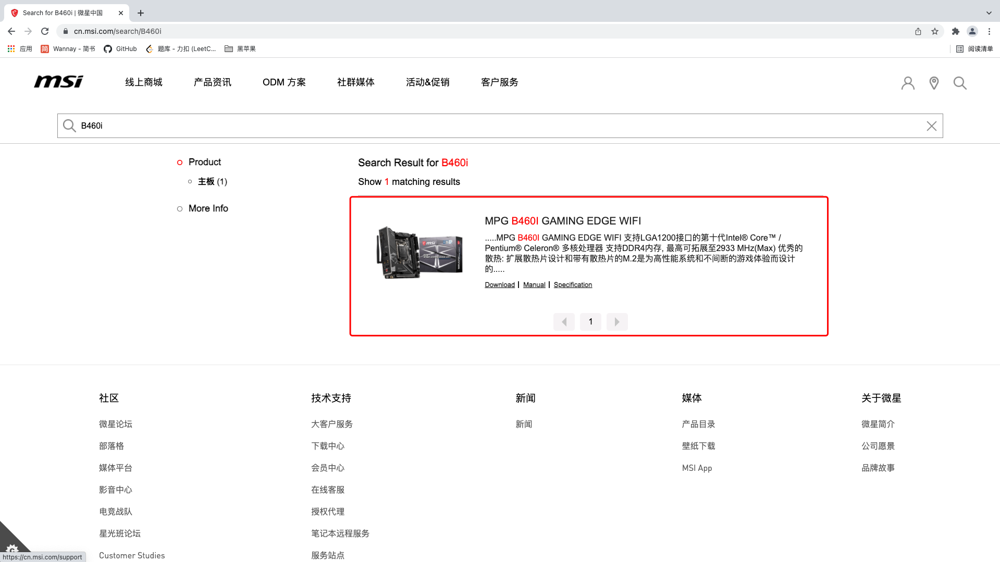
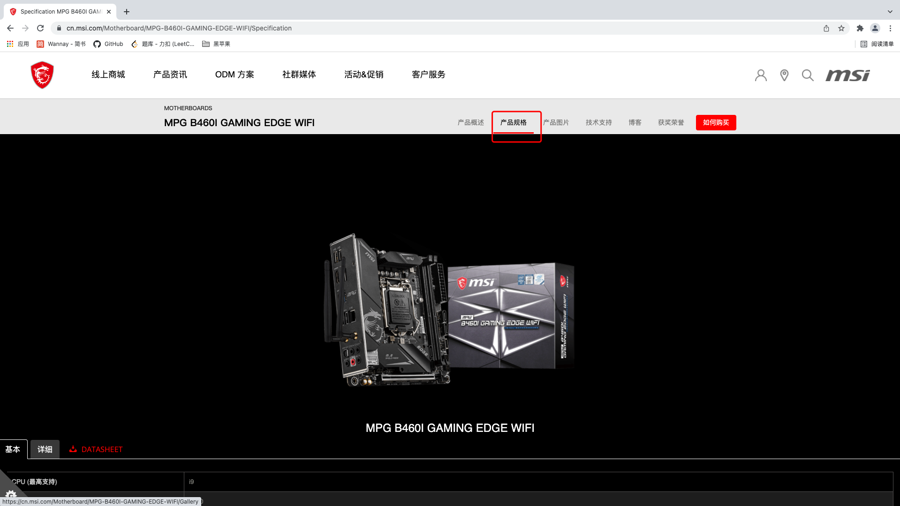
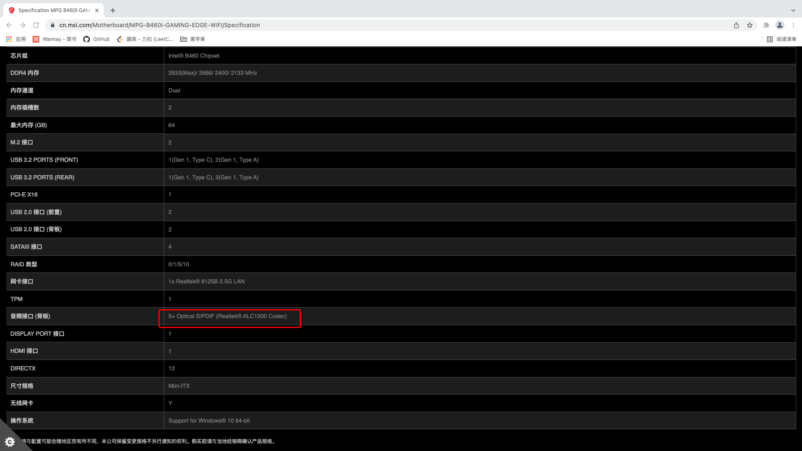
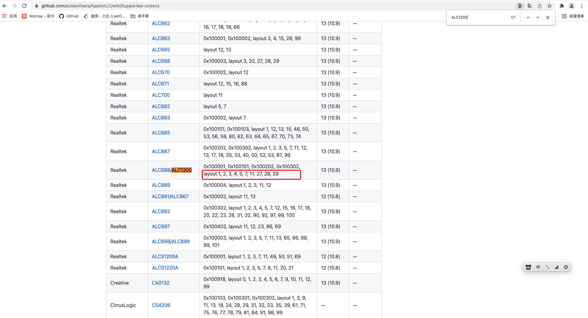
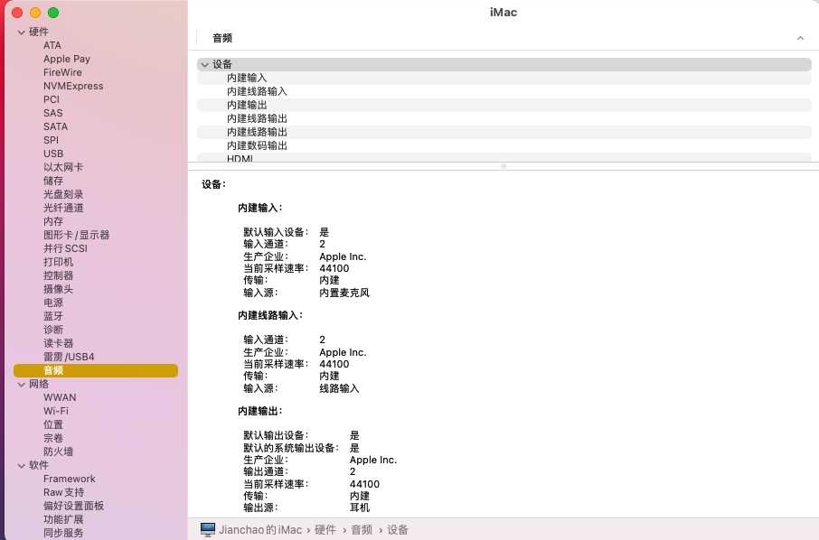

你是否在安装了黑苹果之后，发现自己主机的耳机接口不能使用等音频相关的问题？这种情况一般都是声卡id没设置成功。

在看后文之前请确保"OC/Kext"目录下有"AppleALC.kext"驱动，如果没有，请记得添加AppleAlc驱动，下载地址为：https://github.com/acidanthera/AppleALC/releases

note：下载完成驱动之后前往别忘了更改config配置文件去加载该驱动，不然干啥都是白干。

# 1. 在哪设置声卡alcid？

通过OpenCoreCOnfigurator，依次选择"NVRAM"-"bootargs"，在"bootargs"中添加一项"alcid=x"，就是你的声卡id，声卡id如何确定？请看后文。

# 2. 如何知道自己的声卡id？

要获取声卡id，首先就得获取到自己的声卡型号。

## 2.1 如何获取自己的机器的声卡型号？

* 1.进入百度百科，搜索自己的主板型号，在主板型号中，找到声卡的配置选项。

以我的主板微星B460i为例，我们可以看到主板的声卡型号为ALC1200.

* 2.进入自己的主板官网，查看主板的相关参数

以我的主板为例，首先进入微星官网。

点进搜索，并在搜索结果中选择你的主板正确型号。

进入该主板的首页后，选择产品规格，并往下拉，就可以获取到自己的声卡型号。

## 2.2 如何根据自己的声卡型号，找到合适的alcid

在浏览器中打开https://github.com/acidanthera/AppleALC/wiki/Supported-codecs

并使用Ctrl+F去搜索自己的声卡型号，比如我是ALC1200的声卡，搜索ALC1200(或者1200)。

我们可以看到ALC1200对应的alcid可能为1/2/3/4/5/7/11/27/28/29。这么多个id，有什么办法可以确认具体使用哪个呢？似乎没有什么好的办法，需要挨个试试，把`alcid=x`中的x依次替换为自己声卡可能的id，接着重启电脑。(每更换一次，就得重启一次电脑，还是挺烦的)

重启之后，看看"系统报告"-"音频"中是否多出来了"内建XXX"的选项，如果多出来了这么一个选项，说明你成功了！

