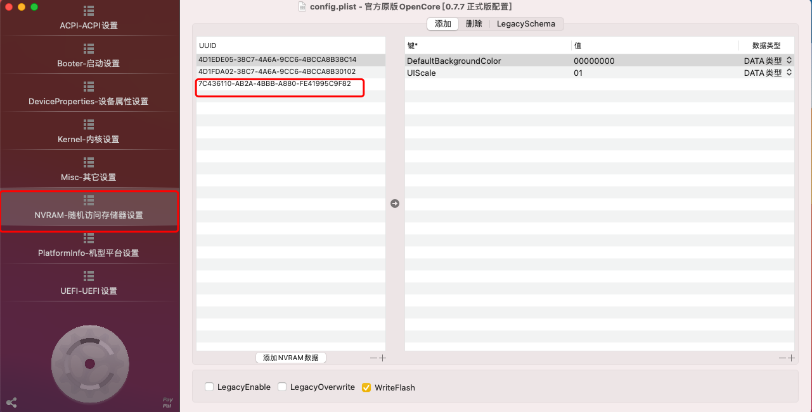
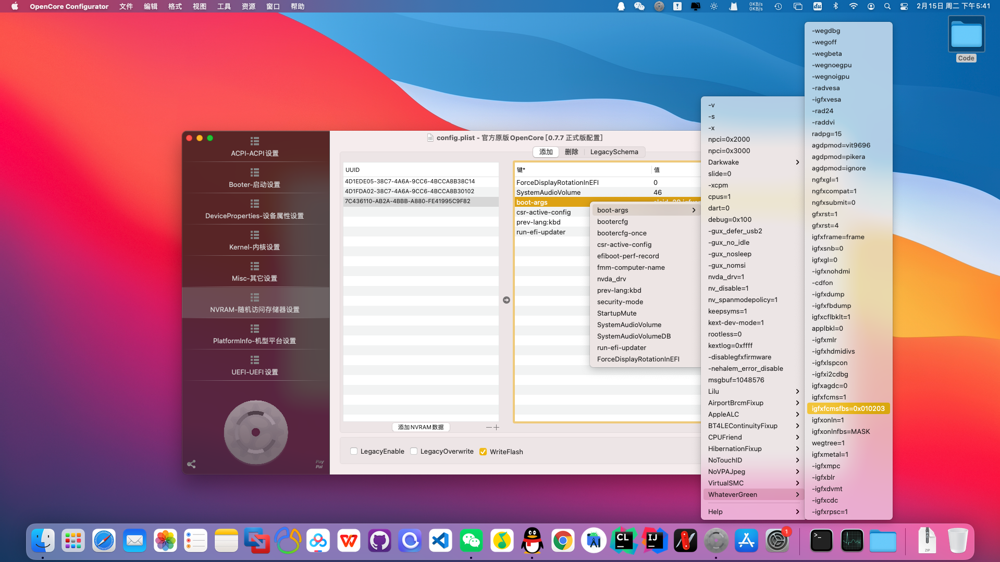
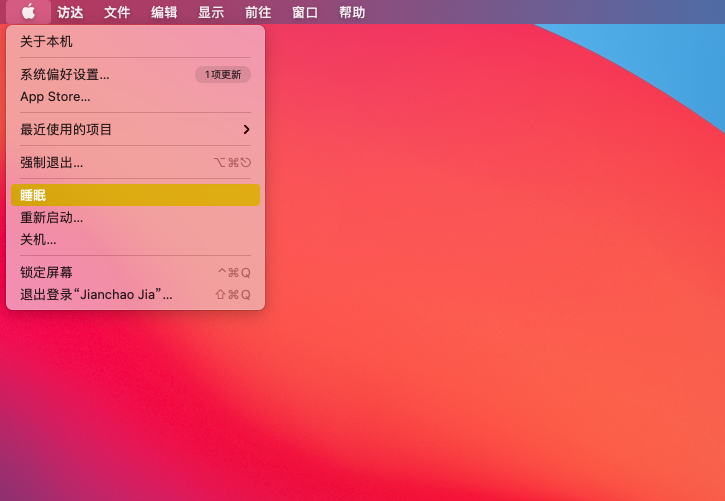
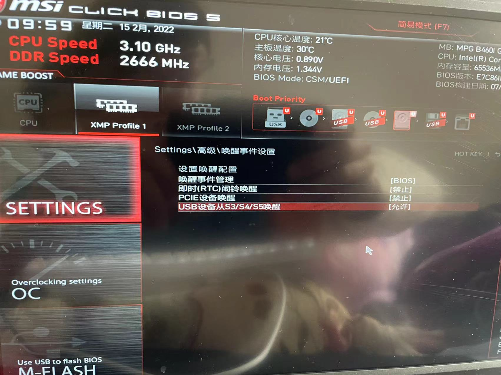

# 1.睡眠问题症状描述

症状描述：

> 黑苹果之前的状态为点击睡眠之后，主机没有处于睡眠状态，风扇也一直都在转，判定为根本没有进入休眠状态，但是显示器已经无信号了。

# 2.睡眠问题解决

解决方式为：

* 1. 更新"Lilu.kext"和"WhateverGreen.kext"这两个内核扩展文件到最新版本。
* 2. 在config.plist中添加启动参数"igfxonln=1"。具体操作步骤如下

首先打开OpenCoreConfigurator工具，并打开EFI/OC/下的config.plist文件，并选择"NVRAM-随机访问存储器设置"，并找到"boot-args"该项。

在"boot-args"中依次选择"boot-args"-"WhateverGreen.kext"-"igfxonln=1"，接着保存config配置文件，并重启。

重启之后，点击睡眠进行测试

刚点击睡眠之后，风扇依旧在转，但是过一会之后就自动灭掉了，我们可以判断睡眠成功。

接着，要处理的就是"唤醒"功能。尝试按下键盘上的某个键，就能唤醒机器(风扇又开始猛转)，如果唤醒失败，但是轻轻按下电源键就能进行唤醒，我们可以猜测很可能是你的主板BIOS没有开启USB唤醒，需要进入主板BIOS去设置USB唤醒。

# 3.在主板中开启USB唤醒支持

下面以微星主板为例：首先关机重启，在看到微星的LOGO时，狂按键盘上右上角的"Delete"键，就可以进入BIOS，可以看到如下页面，这个界面就是微星主板的BIOS页面。

依次选择"SETTINGS"-"高级"-"唤醒事件设置"，将"USB设备从S3/S4/S5唤醒"选项改为允许，接着保存并重启电脑，就能支持从USB唤醒了。

但是当我打开了USB唤醒之后，发现睡眠之后会自动重启(风扇之类的重新转起来了)，目前不知道怎么解决。还是把USB唤醒給关了，就使用主机的开机键来唤醒把(暂时很无奈)。

# 4. 如果没有解决？

请百度其他方式